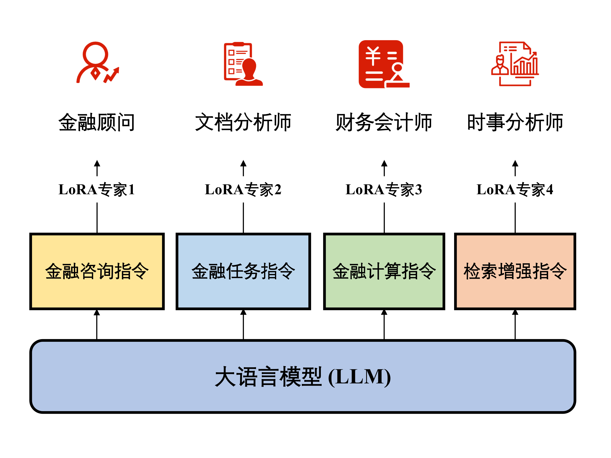

<div align="center">

ZH | [EN](./README-en.md)

<h1>DISC-FinLLM</h1>
  
[](https://huggingface.co/ShengbinYue/DISC-LawLLM)
[](./LICENSE)

[Demo](https://law.fudan-disc.com) | [Technical Report](https://arxiv.org/abs/2309.11325)

</div>

DISC-FinLLM is a large model in the financial field specifically designed to provide users with professional, intelligent, and comprehensive **financial consulting services** in financial scenarios. It is developed by[Fudan University Data Intelligence and Social Computing Laboratory (Fudan-DISC)](http://fudan-disc.com) developed and open source.

We will open source the following resources in this project:
* [DISC-FinLLM model parameters](https://huggingface.co/ShengbinYue/DISC-LawLLM)
* [DISC-Fin-Eval Benchmark](https://huggingface.co/ShengbinYue/DISC-LawLLM)

You can experience our DISC-FinLLM online by visiting this [link](https://fin.fudan-disc.com).


## 目录

- [Overview](#overview)
- [Model Fine-tuning](#model-fine-tuning)
- [Inference and Deployment](#inference-and-deployment)
- [DISC-Fin-Eval Benchmark](#disc-fin-eval-benchmark)
- [Acknowledgements](#acknowledgements)
- [Disclaimer](#disclaimer)
- [Citation](#citation)
- [License](#license)

## Overview


<p></p>

DISC-FinLLM is a large language model in the financial field. It is a multi-expert smart financial system composed of four modules for different financial scenarios: financial consulting, financial text analysis, financial calculation, and financial knowledge retrieval and question answering. These modules showed clear advantages in four evaluations including financial NLP tasks, human test questions, data analysis and current affairs analysis, proving that DISC-FinLLM can provide strong support for a wide range of financial fields. DISC-FinLLM can help in different application scenarios and can be used to implement different functions:

* **Financial Consultation:** This module can start multiple rounds of dialogue with users on financial topics in the Chinese financial context, or explain relevant knowledge of financial majors to users. It is composed of the financial consultation instructions part of the data set. Came for training.
* **Financial Text Analysis:** This module can help users complete NLP tasks such as information extraction, sentiment analysis, text classification, and text generation on financial texts. It is trained by the financial task instructions in the data set.
* **Financial Calculation:** This module can help users complete tasks related to mathematical calculations. In addition to basic calculations such as interest rates and growth rates, it also supports statistical analysis and includes the Black-Scholes option pricing model and the EDF expected default probability model. Financial model calculations included. This module is partially trained from the financial calculation instructions in the data set.
* **Financial Knowledge Retrieval Q&A:** This module can provide users with investment advice, current affairs analysis, and policy interpretation based on financial news, research reports, and related policy documents. It is partially trained from the retrieval enhancement instructions in the dataset.


### Model effect demonstration

#### Financial Consultation


#### Financial Text Analysis


#### Financial Calculation


#### Financial Knowledge Retrieval Q&A


### DISC-Fin-SFT Dataset
DISC-FinLLM is a large financial model based on the high-quality financial data set DISC-Fin-SFT we constructed and fine-tuned the LoRA instruction on the general-domain Chinese large model Baichuan-13B-Chat. DISC-Fin-SFT contains a total of about 250,000 pieces of data, divided into four sub-data sets, which are financial consulting instructions, financial task instructions, financial computing instructions, and retrieval-enhanced instructions.


| Dataset | Samples | Input Length | Output Length  |
|----------------:|----------------:|------------------------------------------------------------:|-----------------------------------------------------------:|
|    Financial Consulting Instructions |             63k |                                                          26 |                                                        369 |
|    Financial Task Instructions |            110k |                                                         676 |                                                         35 |
|    Financial Computing Instructions |             57k |                                                          73 |                                                        190 |
|    Retrieval-enhanced Instructions |             20k |                                                        1031 |                                                        521 |
|    DISC-Fin-SFT |            246k |                                                         351 |                                                        198 |

#### Financial Consulting Instructions

Financial advisory directive data comes from three parts:
- This is an English financial question and answer dataset where the quality of the answers varies. Therefore, we translated all questions in FiQA into Chinese and used ChatGPT to regenerate the answers to the questions to improve the quality of this data set.
- Explanation of financial terms. We collected more than 200 professional terms in the financial field (such as leveraged buyout) from the Internet, and then used ChatGPT to generate corresponding question and answer pairs for these professional terms to train the model to understand financial terms.
- Public posting on the Economic Management Forum. We use the self-chat prompting method to guide ChatGPT to generate multiple rounds of questions and answers around the post topic.

In the process of guiding ChatGPT to generate data, we ensured that the generated questions and answers were in line with China's national conditions, stance, attitude and language style through carefully designed prompts.

#### Financial Task Instructions
Financial task order data comes from two parts:

- Financial NLP dataset. This part is based on the existing financial NLP data set and adapted from manually written prompts. We have collected more than ten open source NLP Chinese data sets, which can be divided into categories such as sentiment analysis, information extraction, text generation, text classification and translation. The distribution of this data set looks like this:


| Dataset            | Major Task Type        | Minor Task Type           | # Samples |
|--------------------|------------------------|---------------------------|-----------:|
| FPB                | Sentiment Analysis     | Sentiment Analysis        |      18690 |
| FIQA-SA            | Sentiment Analysis     | Sentiment Analysis        |          - |
| FNSC               | Sentiment Analysis     | Sentiment Analysis        |          - |
| CCKS-NEC-2022      | Imformation Extraction | Causality Extraction      |       7499 |
| SmoothNLP IEE      | Imformation Extraction | Event Extraction          |       3256 |
| SmoothNLP NHG      | Text Generation        | Text Generation           |       4642 |
| CCKS2022-event     | Text Classification    | Event Type Classification |       3578 |
| Minds14            | Text Classification    | Intent Prediction         |      59143 |
| Financial Report   | Imformation Extraction | Entity Extraction         |      61705 |
| OpenKG             | Imformation Extraction | Entity Extraction         |       7672 |
| OpenKG             | Imformation Extraction | Entity Extraction         |      67921 |
| FDDC2018           | Translation            | Terminology Translation   |        333 |
| Wealth-alpaca-lora | Text Generation     | Keyword Generation        |      41825 |

- Financial unlabeled text dataset. This is a reading comprehension data set of financial texts. We collected a total of 87k articles from Oriental Fortune Network, including financial news and industry research report summaries. Then, based on the paragraphs in these unlabeled texts, we use ChatGPT to obtain instruction pairs.

#### Financial Computing Instructions
In financial calculations, four tools, expression calculator, equation solver, normal probability table, and counter, can help models complete most calculation tasks. Each of the four tools has different calling commands, inputs and outputs. For example, the calculator command is **[Calculator(expression)→result]**. In this part, the purpose of building financial calculation instructions is to train the model to call these tools to solve mathematical problems when appropriate. The definitions of the four tools are shown in the table below:
| 工具名称     | 工具描述                                   |
|--------------|--------------------------------------------|
| 表达式计算器 | 输入：初等函数的数学表达式                 |
|              | 输出：表达式的计算结果（小数表示）         |
| 方程求解器   | 输入：方程组                               |
|              | 输出：方程组的解                           |
| 计数器       | 输入：包含数据样本的数组                   |
|              | 输出：样本数量                             |
| 概率表       | 输入：数字                                 |
|              | 输出：正态分布累积分布函数在这个数字处的值 |

#### Retrieval-enhanced Instructions
检索增强指令的构造分为三步。第一步，我们根据新闻和研报等金融文本构造金融分析问题。第二步，我们在知识库中检索与问题有关的文档，其中参考文档源于我们构建金融知识库，包含18k研报和69k金融新闻。第三步，我们将问题和参考资料结合在一起，生成问题的答案。在这个过程中，问题和答案是由ChatGPT通过Chain-of-Retrieval (CoR) prompting方法生成的。最终我们构建了一个由20k条检索增强指令组成的数据集，其中的指令涵盖了金融领域中主要的分析形式，包括行业分析、政策分析、投资建议、公司战略规划等。

我们开源了部分数据集，您可以访问这个[链接](https://huggingface.co/datasets/ShengbinYue/DISC-Law-SFT)下载数据集。


## 模型微调

### LoRA微调

针对金融领域的不同功能，我们首先采用了多专家微调的训练策略。我们在特定的子数据集上训练模型的各个模组，使它们彼此互不干扰，独立完成不同任务。为此，我们以Baichuan-13B-Chat为基座模型，使用LoRA方法高效地进行参数微调。



通过数据集的四个部分，分别训练4个LoRA专家模组。部署时，用户只需更换在当前基座上的LoRA参数就可以切换功能。因此用户能够根据使用需求激活/停用模型的不同模组，而无需重新加载整个模型。4个LoRA专家模组分别如下：
- 金融顾问：该模型用于多轮对话。由于我们的金融咨询指令数据十分丰富，该模型可以在中国的金融语境下做出高质量的回答，为用户解答金融领域的专业问题，提供优质的咨询服务。
- 文件分析师：该模型主要用于处理金融自然语言处理领域内的各种任务，包括但不限于金融文本中的信息抽取、情绪分析等。
- 财务会计师：DISC-FinLLM支持四种工具，即表达式计算器、方程求解器、计数器和概率表。这些工具支持我们的模型完成金融领域的大多数的计算任务，如金融数学建模、统计分析等。当模型需要使用工具时，它可以生成工具调用命令，然后中断解码，并将工具调用结果添加到生成的文本中。这样，DISC-FinLLM就可以借助工具提供的准确计算结果，回答金融中的计算问题。
- 时事分析师：我们在第四个LoRA训练中引入检索插件。DISC-FinLLM主要参考了三类金融文本：新闻、报告和政策。当用户问及时事、行业趋势或金融政策等常见金融话题时，我们的模型可以检索相关文件，并像金融专家一样展开分析并提供建议。

**您可以直接从 [Hugging Face](https://huggingface.co/Go4miii/DISC-FinLLM) 上下载我们的LoRA模型权重。**

### 全量微调

我们以Baichuan-13B-Chat为基座模型，混合了所有数据，在 8 * Nvidia A800 80 GB + deepspeed 的环境下进行了全量微调测试。

**您可以直接从 [Hugging Face](https://huggingface.co/Go4miii/DISC-FinLLM) 上下载我们的全参模型权重。**


## 推理和部署

当前版本的 DISC-FinLLM 是基于[Baichuan-13B-Chat](https://github.com/baichuan-inc/Baichuan-13B)训练得到的。我们分别使用不同数据进行了LoRA训练，以及使用全部数据进行了全参训练。您可以直接从 [Hugging Face](https://huggingface.co/Go4miii/DISC-FinLLM) 上下载我们的模型权重。


首先，您需要安装项目的依赖环境。

```
pip install -r requirements.txt
```

### Python

#### 全参模型

```python
import torch
from transformers import AutoModelForCausalLM, AutoTokenizer
from transformers.generation.utils import GenerationConfig
from peft import PeftModel, PeftConfig

model_path = "Go4miii/DISC-FinLLM"
model = AutoModelForCausalLM.from_pretrained(
    model_path, torch_dtype=torch.float16, device_map="auto", trust_remote_code=True
)
model.generation_config = GenerationConfig.from_pretrained(model_path)
tokenizer = AutoTokenizer.from_pretrained(
    model_path, use_fast=False, trust_remote_code=True,
)

messages = [
    {"role": "user", "content": "请解释一下什么是银行不良资产？"},
]
response = model.chat(tokenizer, messages)
print(response)
```
#### LoRA模型

```python
import torch
from transformers import AutoModelForCausalLM, AutoTokenizer
from transformers.generation.utils import GenerationConfig
from peft import PeftModel, PeftConfig

model_path = "baichuan-inc/Baichuan-13B-Chat"
model = AutoModelForCausalLM.from_pretrained(
    model_path, torch_dtype=torch.float16, device_map="auto", trust_remote_code=True
)
model.generation_config = GenerationConfig.from_pretrained(model_path)
tokenizer = AutoTokenizer.from_pretrained(
    model_path, use_fast=False, trust_remote_code=True,
)
model = PeftModel.from_pretrained(model, lora_path)

messages = [
    {"role": "user", "content": "请解释一下什么是银行不良资产？"},
]
response = model.chat(tokenizer, messages)
print(response)
```


### 命令行工具

```
python cli_demo.py
```

### 网页 Demo

依靠 streamlit 工具运行以下命令，会在本地启动一个 web 服务，把控制台给出的地址输入浏览器即可访问：

```
streamlit run web_demo.py --server.port 8888
```

此外，目前版本的 DISC-FinLLM 是以 Baichuan-13B 作为基座的，您可以参照 [Baichuan-13B](https://github.com/baichuan-inc/Baichuan-13B) 的介绍来进行 int8 或 int4 量化推理部署以及 CPU 部署。

<!-- ## 模型微调

针对金融领域的不同功能，我们采用了多专家微调的训练策略。我们在特定的子数据集上训练模型的各个模组，使它们彼此互不干扰，独立完成不同任务。为此，我们使用DDP技术的Low-rank adaption（LoRA）方法高效地进行参数微调。

具体来说，我们以Baichuan-13B为基座模型，通过数据集的四个部分，分别训练4个LoRA专家模组，如图12所示。部署时，用户只需更换在当前基座上的LoRA参数就可以切换功能。因此用户能够根据使用需求激活/停用模型的不同模组，而无需重新加载整个模型。4个LoRA专家模组分别如下：
- 金融顾问：该模型用于多轮对话。由于我们的金融咨询指令数据十分丰富，该模型可以在中国的金融语境下做出高质量的回答，为用户解答金融领域的专业问题，提供优质的咨询服务。
- 文件分析师：该模型主要用于处理金融自然语言处理领域内的各种任务，包括但不限于金融文本中的信息抽取、情绪分析等。
- 财务会计师：DISC-FinLLM支持四种工具，即表达式计算器、方程求解器、计数器和概率表。这些工具支持我们的模型完成金融领域的大多数的计算任务，如金融数学建模、统计分析等。当模型需要使用工具时，它可以生成工具调用命令，然后中断解码，并将工具调用结果添加到生成的文本中。这样，DISC-FinLLM就可以借助工具提供的准确计算结果，回答金融中的计算问题。
- 时事分析师：我们在第四个LoRA训练中引入检索插件。DISC-FinLLM主要参考了三类金融文本：新闻、报告和政策。当用户问及时事、行业趋势或金融政策等常见金融话题时，我们的模型可以检索相关文件，并像金融专家一样展开分析并提供建议。 -->


<!-- 开发者可以对 DISC-FinLLM 进行微调使用。在此可以参照与 DISC-LawLLM 兼容的微调工具 [LLaMA Efficient Tuning](https://github.com/hiyouga/LLaMA-Efficient-Tuning) 或是我们的 [DISC-MedLLM](https://github.com/FudanDISC/DISC-MedLLM) 医疗大模型。我们以 [LLaMA Efficient Tuning](https://github.com/hiyouga/LLaMA-Efficient-Tuning) 为例给出**全量**和 **LoRA** 两种微调示例。

首先，下载 [LLaMA Efficient Tuning](https://github.com/hiyouga/LLaMA-Efficient-Tuning) 并按其要求[安装依赖](https://github.com/hiyouga/LLaMA-Efficient-Tuning#getting-started)。注意训练数据按照项目中的要求进行处理。下面我们给出两种微调场景下的脚本样例。

### 全量微调

我们在 8 * Nvidia A800 80 GB + deepspeed 的环境下进行了全量微调测试。训练启动脚本示例如下：

```
deepspeed --num_gpus=8 src/train_bash.py \
    --stage sft \
    --model_name_or_path S heng bin \
    --do_train \
    --dataset alpaca_gpt4_zh \
    --template baichuan \
    --finetuning_type full \
    --output_dir path_to_your_sft_checkpoint \
    --overwrite_cache \
    --per_device_train_batch_size 4 \ 
    --per_device_eval_batch_size 4 \ 
    --gradient_accumulation_steps 8 \ 
    --preprocessing_num_workers 8 \
    --lr_scheduler_type cosine \
    --logging_steps 10 \
    --save_steps 100 \
    --eval_steps 100 \
    --learning_rate 5e-5 \
    --max_grad_norm 0.5 \
    --num_train_epochs 2.0 \
    --dev_ratio 0.01 \
    --evaluation_strategy steps \
    --load_best_model_at_end \
    --plot_loss \
    --fp16 \
    --deepspeed deepspeed.json
```

`deep_speed.json` 配置示例如下：

```json
{
    "train_micro_batch_size_per_gpu": "auto",
    "zero_allow_untested_optimizer": true,
    "fp16": {
        "enabled": "auto",
        "loss_scale": 0,
        "initial_scale_power": 16, 
        "loss_scale_window": 1000,
        "hysteresis": 2,
        "min_loss_scale": 1
    },  
    "zero_optimization": {
        "stage": 2,
        "allgather_partitions": true,
        "allgather_bucket_size": 5e8,
        "overlap_comm": false,
        "reduce_scatter": true,
        "reduce_bucket_size": 5e8,
        "contiguous_gradients" : true
    }
}
```

### LoRA 微调

我们在 4 * Nvidia A800 80G 显卡上进行了 LoRA 微调测试。训练启动脚本示例如下：

```
torchrun --nproc_per_node 4 src/train_bash.py \
    --stage sft \
    --model_name_or_path ShengbinYue/DISC-LawLLM \
    --do_train \
    --dataset alpaca_gpt4_zh \
    --template baichuan \
    --finetuning_type lora \
    --lora_rank 8 \ 
    --lora_target W_pack \
    --output_dir path_to_your_sft_checkpoint \
    --overwrite_cache \
    --per_device_train_batch_size 4 \ 
    --per_device_eval_batch_size 4 \ 
    --gradient_accumulation_steps 8 \ 
    --preprocessing_num_workers 16 \
    --lr_scheduler_type cosine \
    --logging_steps 10 \
    --save_steps 100 \
    --eval_steps 100 \
    --learning_rate 1e-5 \
    --max_grad_norm 0.5 \
    --num_train_epochs 2.0 \
    --dev_ratio 0.01 \
    --evaluation_strategy steps \
    --load_best_model_at_end \
    --plot_loss \
    --fp16
``` -->

## DISC-Fin-Eval-Benchmark

我们建立了一个全面的评估框架 —— DISC-Fin-Eval Benchmark，从各个角度严格评估我们的模型。该评估框架包括四个不同的组成部分，即：金融NLP任务、人类试题、资料分析和时事分析。这一评估框架全面地证明了我们模型能力和训练数据的有效性。您可以点击此[链接](./eval)使用我们的 DISC-Fin-Eval-Benchmark。

### 评测系统

#### 金融NLP任务评测
我们使用FinCUGE评估基准测试模型处理金融NLP任务的能力。这个评测一共包含八项任务，其中包括情感分析、关系抽取、文本摘要、文本分类、事件抽取和其他任务。我们通过提示模板将这个数据集改造为小样本（few-shot）形式，使用常用的准确度（accuracy）、F1和Rouge指标评价模型的表现，来衡量模型在金融领域中理解文本和生成相关回答的能力。评测结果（%）如下：
|  模型   ↓  --评测集 →  | FinFE (Accuracy) | FinQA (F1) | FinCQA (F1) | FinNA (ROUGE) | FinRE (F1) | FinESE (F1) | 平均值 |
|:-----------------:|:----------------:|:----------:|:-----------:|:-------------:|:----------:|:-----------:|:------:|
| Baichuan-13B-Chat |       64.8       |    38.1    |     33.6    |      31.0     |     9.1    |     18.6    |  31.0  |
|            (LoRA) |       69.3       |    42.4    |     42.0    |      30.9     |    10.1    |     45.3    |  40.0  |
|           ChatGLM |       56.7       |    31.8    |     35.1    |      32.5     |    13.0    |     48.7    |  36.3  |
|            (LoRA) |       60.7       |    41.4    |     36.4    |      34.7     |    10.7    |     46.2    |  38.4  |
|          ChatGLM2 |       61.3       |    28.8    |     35.9    |      28.9     |    11.7    |     42.1    |  34.8  |
|            (LoRA) |       65.3       |    37.6    |     36.4    |      33.4     |    11.8    |     39.5    |  37.3  |

**你可以在这里查看我们[金融NLP任务评测](https://github.com/FudanDISC/DISC-FinLLM/tree/main/eval/evaluator)的具体内容。**

#### 人类试题评测
我们使用了FIN-Eval基准评估模型在回答真人生成的金融问题上的能力，这个基准涵盖了金融、经济、会计、证书等学科的高质量多项选择题。我们以准确度为指标，来衡量模型的表现。评测结果（%）如下：
| 模型                     | 金融 | 经济 | 会计 | 证书 | 平均值 |
|--------------------------|-----:|-----:|-----:|-----:|-------:|
| GPT-4                    | 71.0 | 74.5 | 59.3 | 70.4 |   68.6 |
| ChatGPT                  | 59.3 | 61.6 | 45.2 | 55.1 |   55.0 |
| Baichuan-13B-Base        | 52.6 | 50.2 | 43.4 | 53.5 |   50.1 |
| Baichuan-13B-Chat        | 51.6 | 51.1 | 41.7 | 52.8 |   49.4 |
| ChatGLM2-6B              | 46.5 | 46.4 | 44.5 | 51.5 |   47.4 |
| InternLM-7B              | 49.0 | 49.2 | 40.5 | 49.4 |   47.1 |
| InternLM-Chat-7B         | 48.4 | 49.1 | 40.8 | 49.5 |   47.0 |
| LLaMA-2-Chat-70B         | 47.1 | 46.7 | 41.5 | 45.7 |   45.2 |
| FinGPT-v3-6B             | 50.5 | 42.5 | 50.8 | 52.1 |   49.6 |
| DISC-FinLLM （金融咨询） | 54.4 | 45.4 | 52.8 | 51.8 |   51.6 |
| DISC-FinLLM （金融任务） | 57.4 | 48.8 | 49.5 | 49.7 |   51.5 |
| DISC-FinLLM （检索增强） | 56.1 | 44.0 | 49.5 | 50.6 |   50.6 |
| DISC-FinLLM （金融计算） | 54.8 | 50.2 | 46.9 | 50.6 |   50.9 |
| DISC-FinLLM （全数据）   | 53.8 | 47.9 | 42.0 | 49.1 |   48.7 |


#### 资料分析评测
我们手动构造了一个由100个财经计算题组成的数据集，用于评估模型在计算任务中的能力。这些测评问题改编自中国行政职业能力测验中的材料分析计算题，包括计算同比增长率和产值比例等。我们根据模型给出计算公式和计算结果的正确率来评估模型的表现。评测结果如下：
|                          | 计算公式 | 计算公式与结果 |
|--------------------------|:--------:|:--------------:|
| GPT-3.5-turbo            |   0.28   |      0.26      |
| Baichuan-13B-Chat        |   0.20   |      0.12      |
| DISC-FinLLM （金融计算） |   0.35   |      0.35      |


#### 时事分析评测
此评测基于GPT-4模型作出评估。我们构建了一个金融问题数据集，其中的问题需要模型使用最新信息来获得准确答案。然后我们在谷歌等搜索引擎中手动搜索，以收集与每个问题相关的多个参考文段。该数据集旨在评估出模型在回答金融问题时检索信息的相关性和准确性，我们用四个指标评价模型的表现，即准确性、实用性、语言质量和思考性。评测结果如下：
|                          | 准确性 | 实用性 | 语言质量 | 思考性 |
|--------------------------|:------:|:------:|:--------:|:------:|
| Baichuan13B-Chat         |  4.08  |  4.15  |   4.21   |  3.88  |
| DISC-FinLLM （检索增强） |  4.13  |  4.29  |   4.33   |  3.95  |


**你可以在这里查看我们[资料分析评测](https://github.com/FudanDISC/DISC-FinLLM/tree/main/eval/computing_eval.json)、[时事分析评测](https://github.com/FudanDISC/DISC-FinLLM/tree/main/eval/retriever_eval.json)的数据集。**

<!-- ### 主观评测

在主观评测部分，我们采用问答题形式进行评估，模拟主观考试问题的过程。我们从法律咨询、在线论坛、与司法相关的出版物和法律文件中手工构建了一个高质量的测试集。我们用 GPT-3.5 Turbo 作为裁判模型来评估模型的输出，并基于标准答案用准确性、完整性和清晰度这三个标准提供 1-5 的评分。

主观题数据集从来源于法律咨询、网上发帖、司法相关出版物和法律文书中手动构建的一个高质量的测试集，其中包括 300 个示例，涵盖了法律知识问答、法律咨询和判决预测等场景。

**你可以在这里查看我们的[主观评测集](https://github.com/FudanDISC/DISC-LawLLM/tree/main/eval/data/subjective_eval)** -->

<!-- ### 评测结果

客观题评测采用 few-shot 方式，结果（%）如下：

|        模型        |  NJE 单选   |  NJE 多选   |  PAE 单选   |  PAE 多选   |  CPA 单选   |  CPA 多选   | UNGEE 单选  | UNGEE 多选  |  PFE 单选   |  LBK 单选   |   平均   |
|:----------------:|:---------:|:---------:|:---------:|:---------:|:---------:|:---------:|:---------:|:---------:|:---------:|:---------:|:---------:|
|     ChatGLM      |   31.66   |   1.08    |   27.97   |   2.90    |   37.06   |   13.33   |   39.69   |   20.69   |   37.65   |   42.91   |   24.66   |
|  Baichuan-Chat   |   31.47   |   10.15   |   29.66   |   8.70    |   35.53   |   19.17   |   50.00   |   27.59   |   53.12   |   53.45   |   30.78   |
| Chinese-Alpaca-2 |   25.70   |   10.15   |   30.51   |   11.59   |   32.99   |   19.17   |   40.94   |   21.84   |   44.12   |   43.27   |   26.73   |
|  GPT-3.5-turbo   |   36.50   |   10.58   |   37.29   |   17.03   | **42.13** | **21.67** | **51.25** | **28.74** |   53.53   |   54.18   |   34.10   |
|     LexiLaw      |   20.11   |   7.56    |   23.73   |   10.14   |   24.87   |   19.17   |   31.56   |   16.09   |   31.76   |   40.36   |   21.50   |
|      LawGPT      |   22.91   |   6.26    |   31.36   |   7.61    |   25.38   |   16.67   |   30.31   |   13.79   |   34.71   |   29.09   |   20.60   |
|   Lawyer LLaMa   |   35.75   |   5.62    |   32.20   |   6.52    |   29.95   |   13.33   |   32.50   |   14.94   |   39.41   |   39.64   |   25.05   |
|     ChatLaw      |   27.56   |   7.99    |   31.36   |   9.42    |   35.53   |   11.67   |   35.62   |   17.24   |   42.35   |   41.09   |   25.20   |
|   DISC-LawLLM    | **42.09** | **19.87** | **40.68** | **18.48** |   39.59   |   19.17   |   50.94   |   25.29   | **57.06** | **54.91** | **37.10** |

主观题评测分数为 1-5，结果如下：

|        模型        | 准确性  | 完整性  | 清晰性  |  平均  |
|:----------------:|:----:|:----:|:----:|:----:|
|     ChatGLM      | 2.64 | 2.75 | 3.23 | 2.87 |
|  Baichuan-Chat   | 3.22 | **3.34** | 3.18 | 3.25 |
| Chinese-Alpaca-2 | 3.13 | 3.23 | 3.17 | 3.17 |
|     LexiLaw      | 3.06 | 2.62 | 3.00 | 2.90 |
|      LawGPT      | 3.02 | 2.58 | 2.96 | 2.86 |
|   Lawyer LLaMa   | 3.13 | 2.83 | 3.35 | 3.10 |
|     ChatLaw      | 3.31 | 2.90 | 3.35 | 3.19 |
|   DISC-LawLLM    | **3.46** | 3.12 | **3.59** | **3.39** | -->

## 致谢

本项目基于如下开源项目展开，在此对相关项目和开发人员表示诚挚的感谢：

- [**Baichuan-13B**](https://github.com/baichuan-inc/Baichuan-13B)
- [**Langchain-Chatchat**](https://github.com/chatchat-space/Langchain-Chatchat)
- [**LLaMA Efficient Tuning**](https://github.com/hiyouga/LLaMA-Efficient-Tuning)
- [**FireFly**](https://github.com/yangjianxin1/Firefly)
- [**FinEval**](https://github.com/SUFE-AIFLM-Lab/FinEval)

同样感谢其他限于篇幅未能列举的为本项目提供了重要帮助的工作。

## 声明

DISC-FinLLM 有着目前大语言模型尚无法克服的问题和缺陷，尽管它能够在许多任务和情境上提供金融领域的服务，但模型应当仅供用户参考使用，并不能替代专业金融分析师和金融专家，我们希望使用 DISC-FinLLM 的用户以批判性的眼光去评估模型。我们不对因使用 DISC-FinLLM 所引发的任何问题、风险或不良后果承担责任。

## 引用

如果我们的项目对您的研究和工作有帮助，请如下引用我们的项目：

```
@misc{yue2023disclawllm,
    title={DISC-LawLLM: Fine-tuning Large Language Models for Intelligent Legal Services}, 
    author={Shengbin Yue and Wei Chen and Siyuan Wang and Bingxuan Li and Chenchen Shen and Shujun Liu and Yuxuan Zhou and Yao Xiao and Song Yun and Xuanjing Huang and Zhongyu Wei},
    year={2023},
    eprint={2309.11325},
    archivePrefix={arXiv},
    primaryClass={cs.CL}
}
```

## 协议

DISC-FinLLM 可在 Apache 许可证下使用。请查看 [LICENSE](./LICENSE) 文件获取更多信息。


