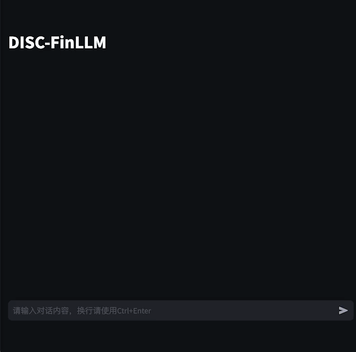
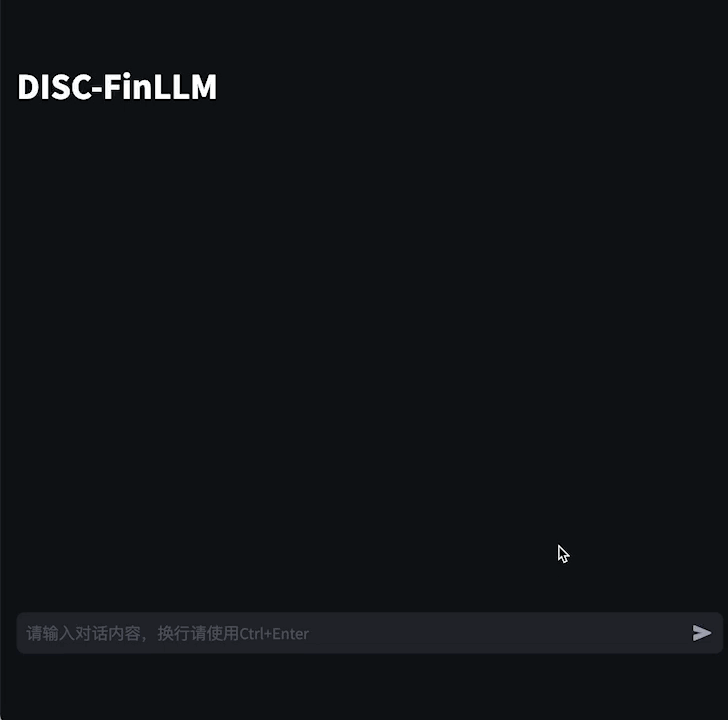
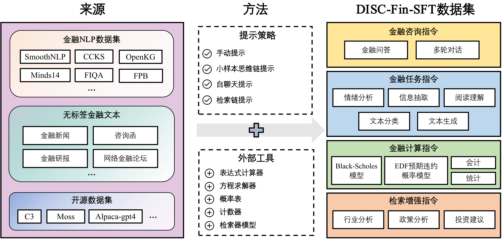
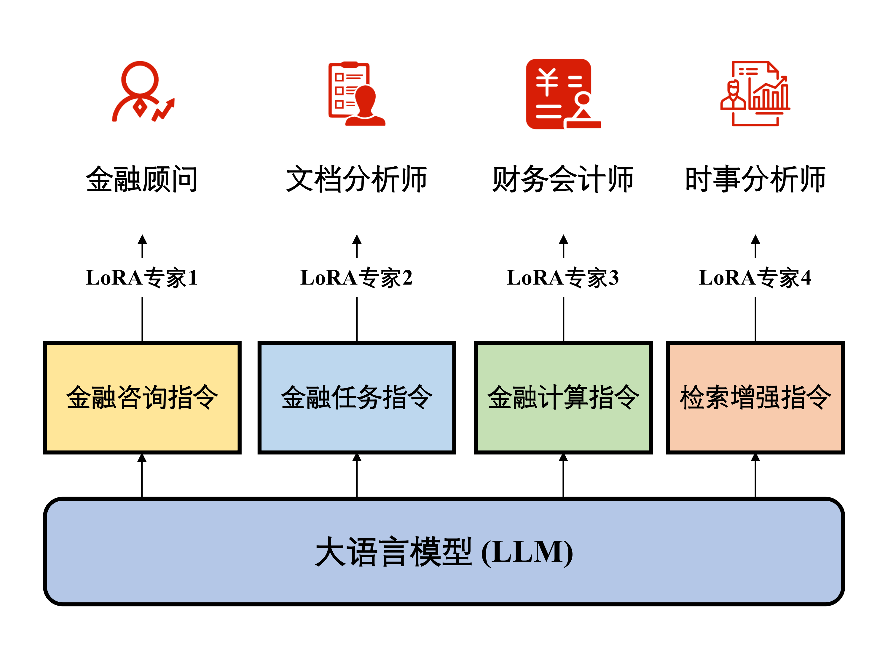

<div align="center">

ZH | [EN](./README-en.md)

<h1>DISC-FinLLM</h1>
  
[](https://huggingface.co/ShengbinYue/DISC-LawLLM)
[](./LICENSE)

[Demo](https://law.fudan-disc.com) | [技术报告](https://arxiv.org/abs/2309.11325)

</div>

DISC-FinLLM 是一个专门针对金融场景下为用户提供专业、智能、全面的**金融咨询服务**的金融领域大模型，由[复旦大学数据智能与社会计算实验室 (Fudan-DISC)](http://fudan-disc.com) 开发并开源。

我们将在该项目中开源如下资源：
* [DISC-FinLLM 模型参数](https://huggingface.co/ShengbinYue/DISC-LawLLM)
* [DISC-Fin-Eval Benchmark](https://huggingface.co/ShengbinYue/DISC-LawLLM)

您可以通过访问这个[链接](https://fin.fudan-disc.com)来在线体验我们的 DISC-FinLLM。


## 目录

- [概述](#概述)
- [模型微调](#模型微调)
- [推理和部署](#推理和部署)
- [DISC-Fin-Eval Benchmark](#disc-fin-eval-benchmark)
- [致谢](#致谢)
- [声明](#声明)
- [引用](#引用)
- [协议](#协议)

## 概述


<p></p>

DISC-FinLLM是一个金融领域的大语言模型，是由面向不同金融场景的4个模组：金融咨询、金融文本分析、金融计算、金融知识检索问答构成的多专家智慧金融系统。这些模组分别在金融NLP任务、人类试题、资料分析和时事分析等四个评测中展现出明显优势，证明了DISC-FinLLM能为广泛的金融领域提供强有力的支持。DISC-FinLLM能在不同应用场景下提供帮助，可用于实现不同的功能：

* **金融咨询：** 该模组可以在中国金融语境下，与用户展开关于金融话题的多轮对话，或是为用户解释金融专业的相关知识，是由数据集中的金融咨询指令部分训练而来。
* **金融文本分析：** 该模组可以帮助用户在金融文本上完成的信息抽取、情感分析、文本分类、文本生成等NLP任务，是由数据集中的金融任务指令部分训练而来。
* **金融计算：** 该模组可以帮助用户完成与数学计算相关的任务，除了利率、增长率等基本计算，它还支持统计分析和包括Black-Scholes期权定价模型、EDF预期违约概率模型在内的金融模型计算。这一模组是由数据集中的金融计算指令部分训练而来。
* **金融知识检索问答：** 该模组可以基于金融新闻、研报和相关政策文件为用户提供投资建议、时事分析、政策解读。它是由数据集中的检索增强指令部分训练而来。


### 模型效果演示

#### 金融咨询


#### 金融文本分析



#### 金融计算



#### 金融知识检索问答


### DISC-Fin-SFT 数据集
DISC-FinLLM是基于我们构建的高质量金融数据集DISC-Fin-SFT在通用领域中文大模型Baichuan-13B-Chat上进行LoRA指令微调得到的金融大模型。DISC-Fin-SFT总共包含约25万条数据，分为四个子数据集，它们分别是金融咨询指令、金融任务指令、金融计算指令、检索增强指令。



| 数据集 | 数据量 | 输入长度 | 输出长度  |
|----------------:|----------------:|------------------------------------------------------------:|-----------------------------------------------------------:|
|    金融咨询指令 |             63k |                                                          26 |                                                        369 |
|    金融任务指令 |            110k |                                                         676 |                                                         35 |
|    金融计算指令 |             57k |                                                          73 |                                                        190 |
|    检索增强指令 |             20k |                                                        1031 |                                                        521 |
|    DISC-Fin-SFT |            246k |                                                         351 |                                                        198 |

#### 金融咨询指令
金融咨询指令数据来源于三部分：
- 这是一个英文的金融问答数据集，其中回答的答案质量参差不齐。因此我们将FiQA中的所有问题翻译成中文，并使用ChatGPT重新生成问题的答案，来提高这一数据集的质量。
- 金融名词解释。我们在网上收集了200多个金融领域的专业术语（如：杠杆收购），然后使用令ChatGPT为这些专业词汇生成相应的问答对，用以训练模型对金融用语的理解。
- 经管之家论坛上的公开发帖。我们利用self-chat prompting方法引导ChatGPT围绕帖子主题生成多轮的问答。

在引导ChatGPT生成数据的过程中，我们通过精心设计的prompt确保生成的问答符合中国的国情、立场、态度和语言风格。

#### 金融任务指令
金融任务指令数据来源于两个部分：
- 金融NLP数据集。该部分是基于已有的金融NLP数据集，通过人工编写的prompt改编而来的，图3就是一个例子。我们搜集了十余个开源的NLP中文数据集，可以分为情绪分析、信息抽取、文本生成、文本分类和翻译等几类。此数据集的分布如下所示：

| 数据集          | 主要任务类型       | 次要任务类型           | 数据量|
|--------------------|------------------------|---------------------------|-----------:|
| FPB                | 情感分析    | 情感分析        |      18690 |
| FIQA-SA            | 情感分析    | 情感分析       |          - |
| FNSC               | 情感分析    | 情感分析        |          - |
| CCKS-NEC-2022      | 信息抽取 | 因果抽取      |       7499 |
| SmoothNLP IEE      | 信息抽取 | 事件抽取         |       3256 |
| SmoothNLP NHG      | 文本生成        | 文本生成           |       4642 |
| CCKS2022-event     | 文本分类    | 事件类型分类 |       3578 |
| Minds14            | 文本分类   | 意图识别        |      59143 |
| Financial Report   | 信息抽取 | 实体抽取         |      61705 |
| OpenKG             | 信息抽取 | 实体抽取            |       7672 |
| OpenKG             | 信息抽取 | 实体抽取           |      67921 |
| FDDC2018           | 翻译            | 术语翻译   |        333 |
| Wealth-alpaca-lora | 文本生成     | 关键词生成       |      41825 |

<!-- | Dataset            | Major Task Type        | Minor Task Type           | \# Samples |
|--------------------|------------------------|---------------------------|-----------:|
| FPB                | Sentiment Analysis     | Sentiment Analysis        |      18690 |
| FIQA-SA            | Sentiment Analysis     | Sentiment Analysis        |          - |
| FNSC               | Sentiment Analysis     | Sentiment Analysis        |          - |
| CCKS-NEC-2022      | Imformation Extraction | Causality Extraction      |       7499 |
| SmoothNLP IEE      | Imformation Extraction | Event Extraction          |       3256 |
| SmoothNLP NHG      | Text Generation        | Text Generation           |       4642 |
| CCKS2022-event     | Text Classification    | Event Type Classification |       3578 |
| Minds14            | Text Classification    | Intent Prediction         |      59143 |
| Financial Report   | Imformation Extraction | Entity Extraction         |      61705 |
| OpenKG             | Imformation Extraction | Entity Extraction         |       7672 |
| OpenKG             | Imformation Extraction | Entity Extraction         |      67921 |
| FDDC2018           | Translation            | Terminology Translation   |        333 |
| Wealth-alpaca-lora | Question Answering     | Question Answering        |      41825 | -->

- 金融无标签文本数据集。这是一个金融文本的阅读理解数据集。我们从东方财富网收集了共87k个文章，包括金融新闻和行业研报摘要。然后，基于这些无标签文本中的段落，我们利用ChatGPT得到指令对。

#### 金融计算指令
在金融计算中，表达式计算器、方程求解器、正态概率表、计数器四种工具可以帮助模型完成大多数的计算任务。四种工具各有不同的调用命令、输入和输出。例如，计算器的命令是 **[Calculator(expression)→result]**。在这一部分，构建金融计算指令的目的就是训练模型在合适的时候调用这些工具解决数学问题。四个工具的定义如下表所示：
| 工具名称     | 工具描述                                   |
|--------------|--------------------------------------------|
| 表达式计算器 | 输入：初等函数的数学表达式                 |
|              | 输出：表达式的计算结果（小数表示）         |
| 方程求解器   | 输入：方程组                               |
|              | 输出：方程组的解                           |
| 计数器       | 输入：包含数据样本的数组                   |
|              | 输出：样本数量                             |
| 概率表       | 输入：数字                                 |
|              | 输出：正态分布累积分布函数在这个数字处的值 |

#### 检索增强指令
检索增强指令的构造分为三步。第一步，我们根据新闻和研报等金融文本构造金融分析问题。第二步，我们在知识库中检索与问题有关的文档，其中参考文档源于我们构建金融知识库，包含18k研报和69k金融新闻。第三步，我们将问题和参考资料结合在一起，生成问题的答案。在这个过程中，问题和答案是由ChatGPT通过Chain-of-Retrieval (CoR) prompting方法生成的。最终我们构建了一个由20k条检索增强指令组成的数据集，其中的指令涵盖了金融领域中主要的分析形式，包括行业分析、政策分析、投资建议、公司战略规划等。

我们开源了部分数据集，您可以访问这个[链接](https://huggingface.co/datasets/ShengbinYue/DISC-Law-SFT)下载数据集。


## 模型微调

### LoRA微调

针对金融领域的不同功能，我们首先采用了多专家微调的训练策略。我们在特定的子数据集上训练模型的各个模组，使它们彼此互不干扰，独立完成不同任务。为此，我们使用DDP技术的Low-rank adaption（LoRA）方法高效地进行参数微调。



具体来说，我们以Baichuan-13B-Chat为基座模型，通过数据集的四个部分，分别训练4个LoRA专家模组。部署时，用户只需更换在当前基座上的LoRA参数就可以切换功能。因此用户能够根据使用需求激活/停用模型的不同模组，而无需重新加载整个模型。4个LoRA专家模组分别如下：
- 金融顾问：该模型用于多轮对话。由于我们的金融咨询指令数据十分丰富，该模型可以在中国的金融语境下做出高质量的回答，为用户解答金融领域的专业问题，提供优质的咨询服务。
- 文件分析师：该模型主要用于处理金融自然语言处理领域内的各种任务，包括但不限于金融文本中的信息抽取、情绪分析等。
- 财务会计师：DISC-FinLLM支持四种工具，即表达式计算器、方程求解器、计数器和概率表。这些工具支持我们的模型完成金融领域的大多数的计算任务，如金融数学建模、统计分析等。当模型需要使用工具时，它可以生成工具调用命令，然后中断解码，并将工具调用结果添加到生成的文本中。这样，DISC-FinLLM就可以借助工具提供的准确计算结果，回答金融中的计算问题。
- 时事分析师：我们在第四个LoRA训练中引入检索插件。DISC-FinLLM主要参考了三类金融文本：新闻、报告和政策。当用户问及时事、行业趋势或金融政策等常见金融话题时，我们的模型可以检索相关文件，并像金融专家一样展开分析并提供建议。


### 全量微调


## 推理和部署

当前版本的 DISC-FinLLM 是基于[Baichuan-13B-Chat](https://github.com/baichuan-inc/Baichuan-13B)训练得到的。我们分别使用不同数据进行了LoRA训练，以及使用全部数据进行了全参训练。您可以直接从 [Hugging Face](https://huggingface.co/Go4miii/DISC-FinLLM) 上下载我们的模型权重。


首先，您需要安装项目的依赖环境。

```
pip install -r requirements.txt
```

### Python

```python
import torch
from transformers import AutoModelForCausalLM, AutoTokenizer
from transformers.generation.utils import GenerationConfig

model_path = "ShengbinYue/DISC-FinLLM"
model = AutoModelForCausalLM.from_pretrained(
    model_path, torch_dtype=torch.float16, device_map="auto", trust_remote_code=True
)
model.generation_config = GenerationConfig.from_pretrained(model_path)
tokenizer = AutoTokenizer.from_pretrained(
    model_path, use_fast=False, trust_remote_code=True,
)

messages = [
    {"role": "user", "content": "生产销售假冒伪劣商品罪如何判刑？"},
]
response = model.chat(tokenizer, messages)
```

### 命令行工具

```
python cli_demo.py
```

### 网页 Demo

依靠 streamlit 工具运行以下命令，会在本地启动一个 web 服务，把控制台给出的地址输入浏览器即可访问：

```
streamlit run web_demo.py --server.port 8888
```

此外，目前版本的 DISC-FinLLM 是以 Baichuan-13B 作为基座的，您可以参照 [Baichuan-13B](https://github.com/baichuan-inc/Baichuan-13B) 的介绍来进行 int8 或 int4 量化推理部署以及 CPU 部署。

<!-- ## 模型微调

针对金融领域的不同功能，我们采用了多专家微调的训练策略。我们在特定的子数据集上训练模型的各个模组，使它们彼此互不干扰，独立完成不同任务。为此，我们使用DDP技术的Low-rank adaption（LoRA）方法高效地进行参数微调。

具体来说，我们以Baichuan-13B为基座模型，通过数据集的四个部分，分别训练4个LoRA专家模组，如图12所示。部署时，用户只需更换在当前基座上的LoRA参数就可以切换功能。因此用户能够根据使用需求激活/停用模型的不同模组，而无需重新加载整个模型。4个LoRA专家模组分别如下：
- 金融顾问：该模型用于多轮对话。由于我们的金融咨询指令数据十分丰富，该模型可以在中国的金融语境下做出高质量的回答，为用户解答金融领域的专业问题，提供优质的咨询服务。
- 文件分析师：该模型主要用于处理金融自然语言处理领域内的各种任务，包括但不限于金融文本中的信息抽取、情绪分析等。
- 财务会计师：DISC-FinLLM支持四种工具，即表达式计算器、方程求解器、计数器和概率表。这些工具支持我们的模型完成金融领域的大多数的计算任务，如金融数学建模、统计分析等。当模型需要使用工具时，它可以生成工具调用命令，然后中断解码，并将工具调用结果添加到生成的文本中。这样，DISC-FinLLM就可以借助工具提供的准确计算结果，回答金融中的计算问题。
- 时事分析师：我们在第四个LoRA训练中引入检索插件。DISC-FinLLM主要参考了三类金融文本：新闻、报告和政策。当用户问及时事、行业趋势或金融政策等常见金融话题时，我们的模型可以检索相关文件，并像金融专家一样展开分析并提供建议。 -->


<!-- 开发者可以对 DISC-FinLLM 进行微调使用。在此可以参照与 DISC-LawLLM 兼容的微调工具 [LLaMA Efficient Tuning](https://github.com/hiyouga/LLaMA-Efficient-Tuning) 或是我们的 [DISC-MedLLM](https://github.com/FudanDISC/DISC-MedLLM) 医疗大模型。我们以 [LLaMA Efficient Tuning](https://github.com/hiyouga/LLaMA-Efficient-Tuning) 为例给出**全量**和 **LoRA** 两种微调示例。

首先，下载 [LLaMA Efficient Tuning](https://github.com/hiyouga/LLaMA-Efficient-Tuning) 并按其要求[安装依赖](https://github.com/hiyouga/LLaMA-Efficient-Tuning#getting-started)。注意训练数据按照项目中的要求进行处理。下面我们给出两种微调场景下的脚本样例。

### 全量微调

我们在 8 * Nvidia A800 80 GB + deepspeed 的环境下进行了全量微调测试。训练启动脚本示例如下：

```
deepspeed --num_gpus=8 src/train_bash.py \
    --stage sft \
    --model_name_or_path S heng bin \
    --do_train \
    --dataset alpaca_gpt4_zh \
    --template baichuan \
    --finetuning_type full \
    --output_dir path_to_your_sft_checkpoint \
    --overwrite_cache \
    --per_device_train_batch_size 4 \ 
    --per_device_eval_batch_size 4 \ 
    --gradient_accumulation_steps 8 \ 
    --preprocessing_num_workers 8 \
    --lr_scheduler_type cosine \
    --logging_steps 10 \
    --save_steps 100 \
    --eval_steps 100 \
    --learning_rate 5e-5 \
    --max_grad_norm 0.5 \
    --num_train_epochs 2.0 \
    --dev_ratio 0.01 \
    --evaluation_strategy steps \
    --load_best_model_at_end \
    --plot_loss \
    --fp16 \
    --deepspeed deepspeed.json
```

`deep_speed.json` 配置示例如下：

```json
{
    "train_micro_batch_size_per_gpu": "auto",
    "zero_allow_untested_optimizer": true,
    "fp16": {
        "enabled": "auto",
        "loss_scale": 0,
        "initial_scale_power": 16, 
        "loss_scale_window": 1000,
        "hysteresis": 2,
        "min_loss_scale": 1
    },  
    "zero_optimization": {
        "stage": 2,
        "allgather_partitions": true,
        "allgather_bucket_size": 5e8,
        "overlap_comm": false,
        "reduce_scatter": true,
        "reduce_bucket_size": 5e8,
        "contiguous_gradients" : true
    }
}
```

### LoRA 微调

我们在 4 * Nvidia A800 80G 显卡上进行了 LoRA 微调测试。训练启动脚本示例如下：

```
torchrun --nproc_per_node 4 src/train_bash.py \
    --stage sft \
    --model_name_or_path ShengbinYue/DISC-LawLLM \
    --do_train \
    --dataset alpaca_gpt4_zh \
    --template baichuan \
    --finetuning_type lora \
    --lora_rank 8 \ 
    --lora_target W_pack \
    --output_dir path_to_your_sft_checkpoint \
    --overwrite_cache \
    --per_device_train_batch_size 4 \ 
    --per_device_eval_batch_size 4 \ 
    --gradient_accumulation_steps 8 \ 
    --preprocessing_num_workers 16 \
    --lr_scheduler_type cosine \
    --logging_steps 10 \
    --save_steps 100 \
    --eval_steps 100 \
    --learning_rate 1e-5 \
    --max_grad_norm 0.5 \
    --num_train_epochs 2.0 \
    --dev_ratio 0.01 \
    --evaluation_strategy steps \
    --load_best_model_at_end \
    --plot_loss \
    --fp16
``` -->

## DISC-Fin-Eval-Benchmark

我们建立了一个全面的评估框架 —— DISC-Fin-Eval Benchmark，从各个角度严格评估我们的模型。该评估框架包括四个不同的组成部分，即：金融NLP任务、人类试题、资料分析和时事分析。这一评估框架全面地证明了我们模型能力和训练数据的有效性。您可以点击此[链接](./eval)使用我们的 DISC-Fin-Eval-Benchmark。

### 评测系统

#### 金融NLP任务评测
我们使用FinCUGE评估基准测试模型处理金融NLP任务的能力。这个评测一共包含八项任务，其中包括情感分析、关系抽取、文本摘要、文本分类、事件抽取和其他任务。我们通过提示模板将这个数据集改造为小样本（few-shot）形式，使用常用的准确度（accuracy）、F1和Rouge指标评价模型的表现，来衡量模型在金融领域中理解文本和生成相关回答的能力。评测结果（%）如下：
|  模型   ↓  --评测集 →  | FinFE (Accuracy) | FinQA (F1) | FinCQA (F1) | FinNA (ROUGE) | FinRE (F1) | FinESE (F1) | 平均值 |
|:-----------------:|:----------------:|:----------:|:-----------:|:-------------:|:----------:|:-----------:|:------:|
| Baichuan-13B-Chat |       64.8       |    38.1    |     33.6    |      31.0     |     9.1    |     18.6    |  31.0  |
|            (LoRA) |       69.3       |    42.4    |     42.0    |      30.9     |    10.1    |     45.3    |  40.0  |
|           ChatGLM |       56.7       |    31.8    |     35.1    |      32.5     |    13.0    |     48.7    |  36.3  |
|            (LoRA) |       60.7       |    41.4    |     36.4    |      34.7     |    10.7    |     46.2    |  38.4  |
|          ChatGLM2 |       61.3       |    28.8    |     35.9    |      28.9     |    11.7    |     42.1    |  34.8  |
|            (LoRA) |       65.3       |    37.6    |     36.4    |      33.4     |    11.8    |     39.5    |  37.3  |

**你可以在这里查看我们[金融NLP任务评测](https://github.com/FudanDISC/DISC-FinLLM/tree/main/eval/evaluator)的具体内容。**

#### 人类试题评测
我们使用了FIN-Eval基准评估模型在回答真人生成的金融问题上的能力，这个基准涵盖了金融、经济、会计、证书等学科的高质量多项选择题。我们以准确度为指标，来衡量模型的表现。评测结果（%）如下：
| 模型                     | 金融 | 经济 | 会计 | 证书 | 平均值 |
|--------------------------|-----:|-----:|-----:|-----:|-------:|
| GPT-4                    | 71.0 | 74.5 | 59.3 | 70.4 |   68.6 |
| ChatGPT                  | 59.3 | 61.6 | 45.2 | 55.1 |   55.0 |
| Baichuan-13B-Base        | 52.6 | 50.2 | 43.4 | 53.5 |   50.1 |
| Baichuan-13B-Chat        | 51.6 | 51.1 | 41.7 | 52.8 |   49.4 |
| ChatGLM2-6B              | 46.5 | 46.4 | 44.5 | 51.5 |   47.4 |
| InternLM-7B              | 49.0 | 49.2 | 40.5 | 49.4 |   47.1 |
| InternLM-Chat-7B         | 48.4 | 49.1 | 40.8 | 49.5 |   47.0 |
| LLaMA-2-Chat-70B         | 47.1 | 46.7 | 41.5 | 45.7 |   45.2 |
| FinGPT-v3-6B             | 50.5 | 42.5 | 50.8 | 52.1 |   49.6 |
| DISC-FinLLM （金融咨询） | 54.4 | 45.4 | 52.8 | 51.8 |   51.6 |
| DISC-FinLLM （金融任务） | 57.4 | 48.8 | 49.5 | 49.7 |   51.5 |
| DISC-FinLLM （检索增强） | 56.1 | 44.0 | 49.5 | 50.6 |   50.6 |
| DISC-FinLLM （金融计算） | 54.8 | 50.2 | 46.9 | 50.6 |   50.9 |
| DISC-FinLLM （全数据）   | 53.8 | 47.9 | 42.0 | 49.1 |   48.7 |


#### 资料分析评测
我们手动构造了一个由100个财经计算题组成的数据集，用于评估模型在计算任务中的能力。这些测评问题改编自中国行政职业能力测验中的材料分析计算题，包括计算同比增长率和产值比例等。我们根据模型给出计算公式和计算结果的正确率来评估模型的表现。评测结果如下：
|                          | 计算公式 | 计算公式与结果 |
|--------------------------|:--------:|:--------------:|
| GPT-3.5-turbo            |   0.28   |      0.26      |
| Baichuan-13B-Chat        |   0.20   |      0.12      |
| DISC-FinLLM （金融计算） |   0.35   |      0.35      |


#### 时事分析评测
此评测基于GPT-4模型作出评估。我们构建了一个金融问题数据集，其中的问题需要模型使用最新信息来获得准确答案。然后我们在谷歌等搜索引擎中手动搜索，以收集与每个问题相关的多个参考文段。该数据集旨在评估出模型在回答金融问题时检索信息的相关性和准确性，我们用四个指标评价模型的表现，即准确性、实用性、语言质量和思考性。评测结果如下：
|                          | 准确性 | 实用性 | 语言质量 | 思考性 |
|--------------------------|:------:|:------:|:--------:|:------:|
| Baichuan13B-Chat         |  4.08  |  4.15  |   4.21   |  3.88  |
| DISC-FinLLM （检索增强） |  4.13  |  4.29  |   4.33   |  3.95  |


**你可以在这里查看我们[资料分析评测](https://github.com/FudanDISC/DISC-FinLLM/tree/main/eval/computing_eval.json)、[时事分析评测](https://github.com/FudanDISC/DISC-FinLLM/tree/main/eval/retriever_eval.json)的数据集。**

<!-- ### 主观评测

在主观评测部分，我们采用问答题形式进行评估，模拟主观考试问题的过程。我们从法律咨询、在线论坛、与司法相关的出版物和法律文件中手工构建了一个高质量的测试集。我们用 GPT-3.5 Turbo 作为裁判模型来评估模型的输出，并基于标准答案用准确性、完整性和清晰度这三个标准提供 1-5 的评分。

主观题数据集从来源于法律咨询、网上发帖、司法相关出版物和法律文书中手动构建的一个高质量的测试集，其中包括 300 个示例，涵盖了法律知识问答、法律咨询和判决预测等场景。

**你可以在这里查看我们的[主观评测集](https://github.com/FudanDISC/DISC-LawLLM/tree/main/eval/data/subjective_eval)** -->

<!-- ### 评测结果

客观题评测采用 few-shot 方式，结果（%）如下：

|        模型        |  NJE 单选   |  NJE 多选   |  PAE 单选   |  PAE 多选   |  CPA 单选   |  CPA 多选   | UNGEE 单选  | UNGEE 多选  |  PFE 单选   |  LBK 单选   |   平均   |
|:----------------:|:---------:|:---------:|:---------:|:---------:|:---------:|:---------:|:---------:|:---------:|:---------:|:---------:|:---------:|
|     ChatGLM      |   31.66   |   1.08    |   27.97   |   2.90    |   37.06   |   13.33   |   39.69   |   20.69   |   37.65   |   42.91   |   24.66   |
|  Baichuan-Chat   |   31.47   |   10.15   |   29.66   |   8.70    |   35.53   |   19.17   |   50.00   |   27.59   |   53.12   |   53.45   |   30.78   |
| Chinese-Alpaca-2 |   25.70   |   10.15   |   30.51   |   11.59   |   32.99   |   19.17   |   40.94   |   21.84   |   44.12   |   43.27   |   26.73   |
|  GPT-3.5-turbo   |   36.50   |   10.58   |   37.29   |   17.03   | **42.13** | **21.67** | **51.25** | **28.74** |   53.53   |   54.18   |   34.10   |
|     LexiLaw      |   20.11   |   7.56    |   23.73   |   10.14   |   24.87   |   19.17   |   31.56   |   16.09   |   31.76   |   40.36   |   21.50   |
|      LawGPT      |   22.91   |   6.26    |   31.36   |   7.61    |   25.38   |   16.67   |   30.31   |   13.79   |   34.71   |   29.09   |   20.60   |
|   Lawyer LLaMa   |   35.75   |   5.62    |   32.20   |   6.52    |   29.95   |   13.33   |   32.50   |   14.94   |   39.41   |   39.64   |   25.05   |
|     ChatLaw      |   27.56   |   7.99    |   31.36   |   9.42    |   35.53   |   11.67   |   35.62   |   17.24   |   42.35   |   41.09   |   25.20   |
|   DISC-LawLLM    | **42.09** | **19.87** | **40.68** | **18.48** |   39.59   |   19.17   |   50.94   |   25.29   | **57.06** | **54.91** | **37.10** |

主观题评测分数为 1-5，结果如下：

|        模型        | 准确性  | 完整性  | 清晰性  |  平均  |
|:----------------:|:----:|:----:|:----:|:----:|
|     ChatGLM      | 2.64 | 2.75 | 3.23 | 2.87 |
|  Baichuan-Chat   | 3.22 | **3.34** | 3.18 | 3.25 |
| Chinese-Alpaca-2 | 3.13 | 3.23 | 3.17 | 3.17 |
|     LexiLaw      | 3.06 | 2.62 | 3.00 | 2.90 |
|      LawGPT      | 3.02 | 2.58 | 2.96 | 2.86 |
|   Lawyer LLaMa   | 3.13 | 2.83 | 3.35 | 3.10 |
|     ChatLaw      | 3.31 | 2.90 | 3.35 | 3.19 |
|   DISC-LawLLM    | **3.46** | 3.12 | **3.59** | **3.39** | -->

## 致谢

本项目基于如下开源项目展开，在此对相关项目和开发人员表示诚挚的感谢：

- [**Baichuan-13B**](https://github.com/baichuan-inc/Baichuan-13B)
- [**Langchain-Chatchat**](https://github.com/chatchat-space/Langchain-Chatchat)
- [**LLaMA Efficient Tuning**](https://github.com/hiyouga/LLaMA-Efficient-Tuning)
- [**FireFly**](https://github.com/yangjianxin1/Firefly)
- [**FinEval**](https://github.com/SUFE-AIFLM-Lab/FinEval)

同样感谢其他限于篇幅未能列举的为本项目提供了重要帮助的工作。

## 声明

DISC-FinLLM 有着目前大语言模型尚无法克服的问题和缺陷，尽管它能够在许多任务和情境上提供金融领域的服务，但模型应当仅供用户参考使用，并不能替代专业金融分析师和金融专家，我们希望使用 DISC-FinLLM 的用户以批判性的眼光去评估模型。我们不对因使用 DISC-FinLLM 所引发的任何问题、风险或不良后果承担责任。

## 引用

如果我们的项目对您的研究和工作有帮助，请如下引用我们的项目：

```
@misc{yue2023disclawllm,
    title={DISC-LawLLM: Fine-tuning Large Language Models for Intelligent Legal Services}, 
    author={Shengbin Yue and Wei Chen and Siyuan Wang and Bingxuan Li and Chenchen Shen and Shujun Liu and Yuxuan Zhou and Yao Xiao and Song Yun and Xuanjing Huang and Zhongyu Wei},
    year={2023},
    eprint={2309.11325},
    archivePrefix={arXiv},
    primaryClass={cs.CL}
}
```

## 协议

DISC-FinLLM 可在 Apache 许可证下使用。请查看 [LICENSE](./LICENSE) 文件获取更多信息。


<!-- ## Star History

<picture>
    <source media="(prefers-color-scheme: dark)" srcset="https://api.star-history.com/svg?repos=FudanDISC/DISC-LawLLM&type=Date&theme=dark" />
    <source media="(prefers-color-scheme: light)" srcset="https://api.star-history.com/svg?repos=FudanDISC/DISC-LawLLM&type=Date" />
    
</picture> -->
